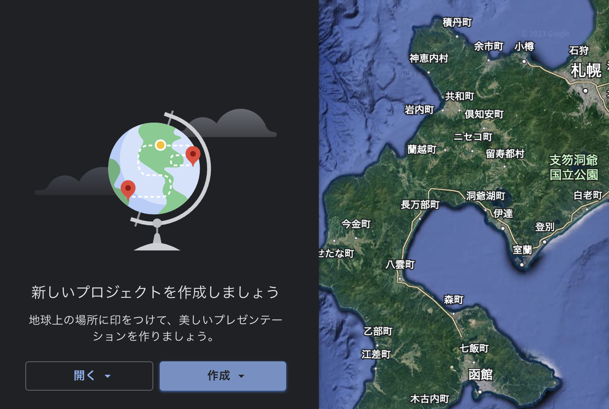
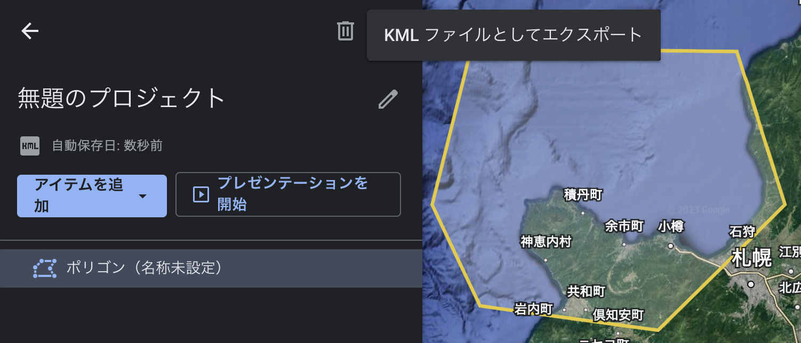

# Kakoibune

[Locked Shields] A program that determines points inside and outside of a geofence to analyze how many vessels are staying in an area and for how long.

### Setup

This guide assumes that you have installed python 3.x on your machine, preferably python 3.7 and above.

'''pip install -r requirements.txt'''

### Generating kml file

https://earth.google.com/web/

Click on the blue glowing icon in this image from the left menu bar 

Create a new project > Create KML file 



Add Items > Draw Lines and Shapes

Press the back button in the upper left corner, press the three dots next to the trashcan, and click Export as KML file to download the kml file.




### Counting vessels within the geofence using AIS data

```
$ python main.py otaru.kml AIS_2023_01_01.csv
```
